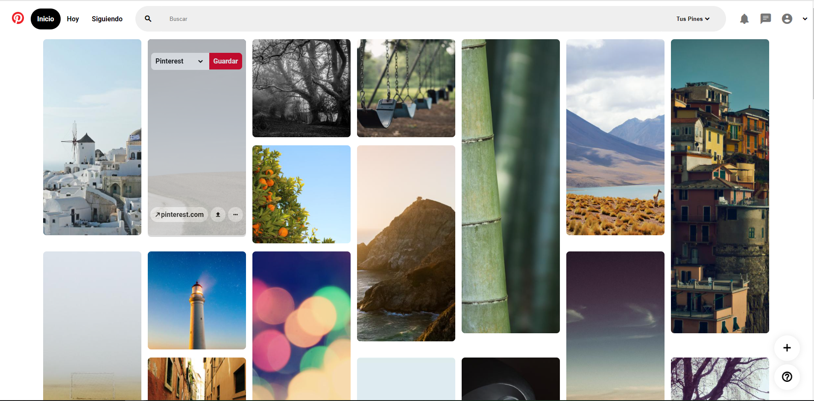
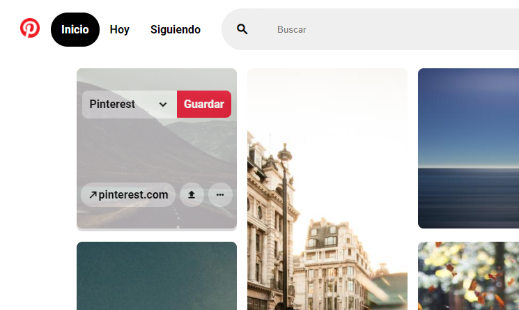

# Proyecto Pinterest Clone Web

Este proyecto usa la API de **[Lorem Picsum](https://picsum.photos/)**, consumiendola desde JS, usando CSS Grid Layout junto a HTML :computer: para hacer el layout de Pinterest :fire:

### Demo :computer:

Pulsa aqui para ver el **[Demo](https://cesarchoqueskater.github.io/PinterestCloneWeb/)** 

### Imagenes :camera:

[](screenshots/ImageScreen.png)


[](screenshots/ImageScreen_two.png)

### Configuración :wrench:
En el archivo picsum.js seteamos un valor por defecto, que indica la cantidad de imagenes que obtendremos del API.
Cabe mencionar que revisando la documentacion se tiene 1000 imagenes nada más.

```javascript
const arraySize = 'cantidad de Imagenes'
```


  

>**Nota** :eyes:
En esta aplicación usamos iconos del sitio [material.io](https://material.io/) :framed_picture:
